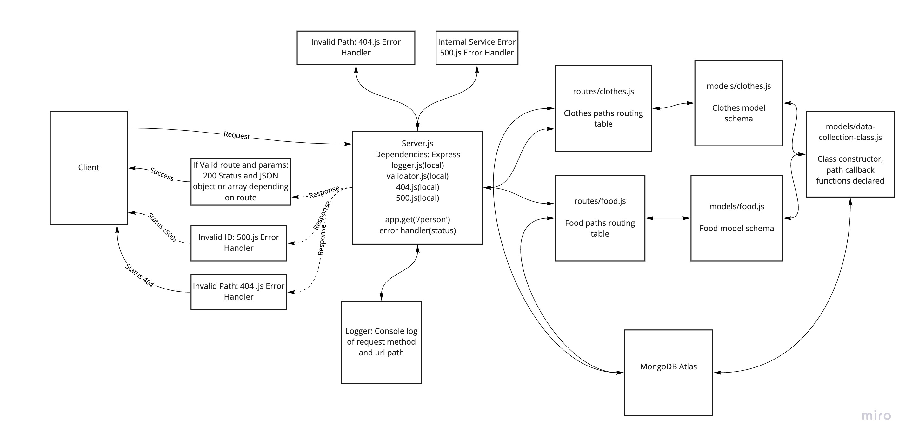

# api-server

## Github PR
* https://github.com/gerstej9/api-server/pulls?q=is%3Apr+is%3Aclosed

## Github Actions
https://github.com/gerstej9/api-server/actions

## Heroku URLs
https://jamesgersten-api-server.herokuapp.com/

## UML

## Class notes
* Learn how to combine class constructor and schema model
* Learn how to use mongoDB and mongoDB atlas
* Learn how to create functions for operating with mongo
* Learn how to test with mongoDB databases